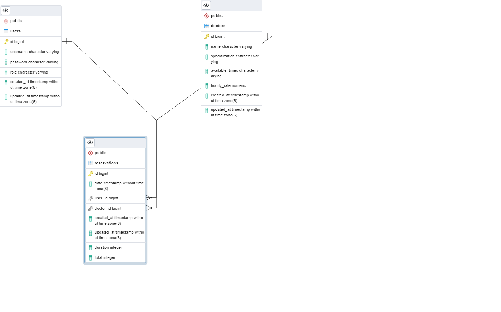

# medibook-api
Backend API for the Medi-Book health appointment platform

This app uses a Rails back-end as an API to send doctor details and appointment data to the frontend of a booking application.

Enjoy your API!

## Link to demo

[demo link]()

## medibook API Entity Relationship Diagram (ERD)

## Link to Kanban
- [Kanban Board Link](https://github.com/orgs/medi-book/projects/1)
 
## Group Members
Our group consists of 5 members and we are:
@Sodiq - Team Member
@Fantomas - Team Member
@Ifza - Team Member
@Oybek - Team Member
@Kantush - Team Member

## Link to REACT FRONTEND

[REACT FRONTEND](https://github.com/medi-book/medibook-api)

## Built With

- Ruby
- Ruby on Rails
- React
- Redux
- Linters
- PostgreSQL
- Heroku
- Rspec
- Rswag

## Milestones

[Project Requirements](https://github.com/microverseinc/curriculum-final-capstone/blob/main/projects/business_requirements.md) - distributed into milestones below:

## API Endpoints

[Live server: Rswag api documentations](https://)

## Getting Started

To get a local copy up and running follow these simple example steps.

## Pre-requisites

Make sure you have Ruby and Rails installed on your computer. If not, you can follow this [tutorial](https://guides.rubyonrails.org/getting_started.html#creating-a-new-rails-project) to install them.

If you don't have PostgreSQL installed, you can follow this [tutorial](https://www.postgresql.org/download/) to install it.

## Usage

In your terminal, navigate to your current directory and run this code

`git clone https://github.com/medi-book/medibook-api`

Then run:

`cd medibook-api`

Open the project in your favorite code editor. `code .` for VS Code.

- Use the command `bundle install` or just simply `bundle` to install all project dependencies.
- Run `rails db:create db:migrate db:seed` to create the database and run migrations.
- You might need to supply a username and password for your PostgreSQL database if you run into an error with the previous step.
- Simply navigate to `config/database.yml` and add your username and password to the `username` and `password` fields.

Start terminal

`rails s`

- Then click on `http://127.0.0.1:3000`

Enjoy your fantastic Doctoral bookings as your app opens in the web browser!

## Run Linters:

### To run rubocop we use:

`rubocop`

### To autocorrect offenses with rubocop we use:

`rubocop -A`

## Testing
### Run Test for models

`rspec spec`

## Usage

- Login into Medibook App with your username
- Click on the list of Doctors to see their specific detailed information
- From Navigation or from details page click 'Reserve' to book an appointment
- Click from Navigation panel, 'My Reservation' to view a list of your appointment details

Enjoy saving time on long appointment calls by using our top ranking appointment booking App!

👤 **Sodiq Aderibigbe**

- GitHub: [@deyemiobaa](https://github.com/deyemiobaa)
- Twitter: [@deyemiobaa](https://twitter.com/deyemiobaa)
- LinkedIn: [Sodiq Aderibigbe](https://linkedin.com/in/sodiqa)

👤 **Anicet Murhula**

- GitHub: [@AnicetFantomas](https://github.com/AnicetFantomas)
- Twitter: [@FantomasAnicet](https://twitter.com/FantomasAnicet)
- LinkedIn: [Anicet Murhula](https://www.linkedin.com/in/anicet-murhula/)

👤 **IFZA Rasool**
- GitHub: [@ifzarasool](https://github.com/IfzaRasool
- Twitter: [@ifzaarain](https://twitter.com/ifzaarain)
- LinkedIn: [@ifza-arain]https://www.linkedin.com/in/ifza-arain/

👤 **Oybek Kayumov**

- GitHub: [@OybekKayumov](https://github.com/OybekKayumov)
- Twitter: [@KayumovOybek](https://twitter.com/KayumovOybek)
- LinkedIn: [Oybek Kayumov](https://www.linkedin.com/in/oybek-kayumov/)

👤 **Saningo Lekalantula**

- GitHub: [@sainingo](https://github.com/sainingo)
- Twitter: [@sainingo](https://www.linkedin.com/in/sainingo/)
- LinkedIn: [sainingo](https://twitter.com/saningoInn)

## 🤝 Contributing

Contributions, issues, and feature requests are welcome!

Feel free to check the [issues page](https://github.com/medi-book/medibook-api/issues).

## Show your support

Give a ⭐️ if you like this project!

## Acknowledgments

- Hat tip to anyone whose code was used
- Original design idea by [Murat Korkmaz on Behance.]('https://www.behance.net/muratk')

## 📝 License

This project is [MIT](./MIT.md) licensed.
